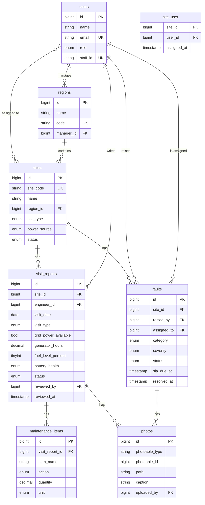

# ER diagram

GitHub renders this diagram below. To get an image, paste the mermaid block into mermaid.live and export a PNG or SVG.

```mermaid
erDiagram
    users ||--o{ regions : "manages"
    users }o--o{ sites : "assigned to"
    regions ||--o{ sites : "contains"
    sites ||--o{ visit_reports : "has"
    users ||--o{ visit_reports : "writes"
    visit_reports ||--o{ maintenance_items : "has"
    sites ||--o{ faults : "has"
    users ||--o{ faults : "raises"
    users ||--o{ faults : "is assigned"
    visit_reports ||--o{ photos : "has"
    faults ||--o{ photos : "has"

    users {
        bigint id PK
        string name
        string email UK
        enum role
        string staff_id UK
    }

    regions {
        bigint id PK
        string name
        string code UK
        bigint manager_id FK
    }

    sites {
        bigint id PK
        string site_code UK
        string name
        bigint region_id FK
        enum site_type
        enum power_source
        enum status
    }

    site_user {
        bigint site_id FK
        bigint user_id FK
        timestamp assigned_at
    }

    visit_reports {
        bigint id PK
        bigint site_id FK
        bigint engineer_id FK
        date visit_date
        enum visit_type
        bool grid_power_available
        decimal generator_hours
        tinyint fuel_level_percent
        enum battery_health
        enum status
        bigint reviewed_by FK
        timestamp reviewed_at
    }

    maintenance_items {
        bigint id PK
        bigint visit_report_id FK
        string item_name
        enum action
        decimal quantity
        enum unit
    }

    faults {
        bigint id PK
        bigint site_id FK
        bigint raised_by FK
        bigint assigned_to FK
        enum category
        enum severity
        enum status
        timestamp sla_due_at
        timestamp resolved_at
    }

    photos {
        bigint id PK
        string photoable_type
        bigint photoable_id
        string path
        string caption
        bigint uploaded_by FK
    }
```
